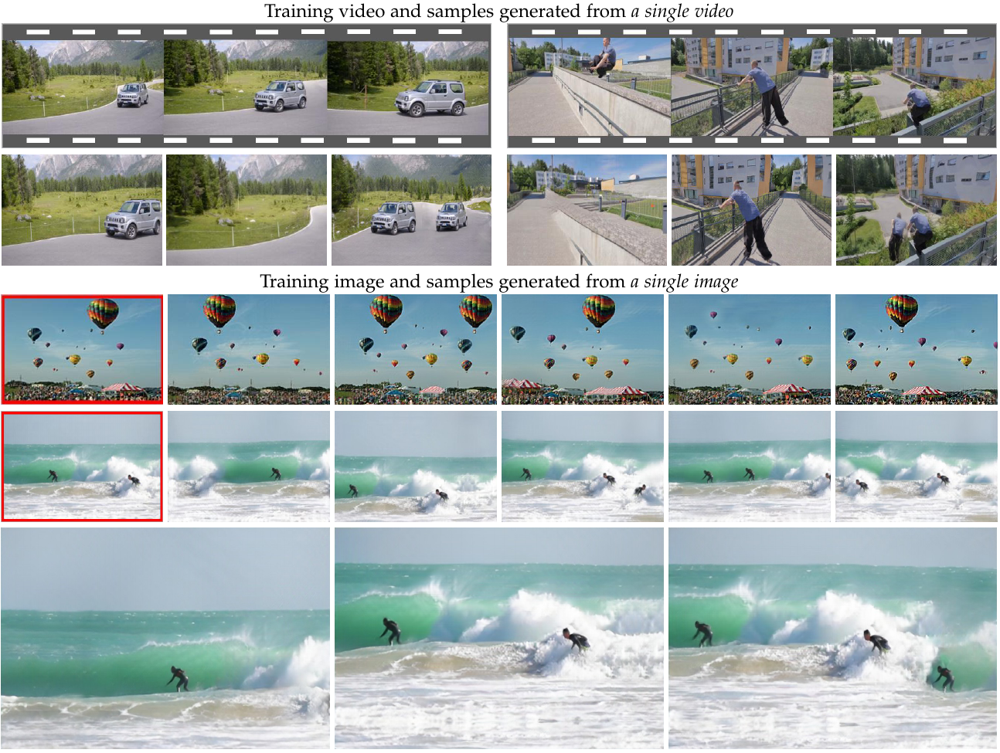
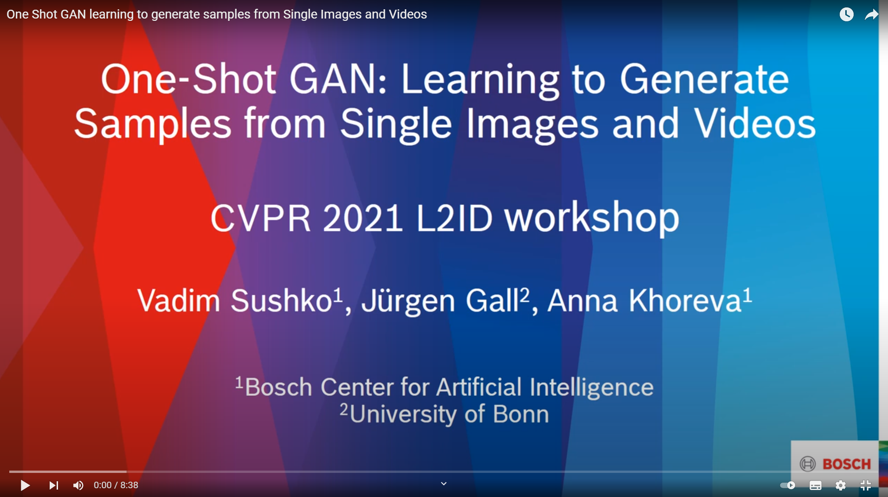

# Overview

This repository implements SIV-GAN [[Link to Paper](https://arxiv.org/abs/2103.13389)], an unconditional GAN model that can be trained in extremely low data regimes, such as learning from a single image or from a single video. The model was also presented as One-Shot GAN at the CVPR 2021 workshop for Learning from Limited and Imperfect Data [[Link to the Workshop Version](https://openaccess.thecvf.com/content/CVPR2021W/LLID/html/Sushko_One-Shot_GAN_Learning_To_Generate_Samples_From_Single_Images_and_CVPRW_2021_paper.html)]. The code allows the users to
reproduce and extend the results reported in the study. Please cite the paper when reporting, reproducing or extending the results.


<p align="center">

</p>


## Setup

The code is tested for Python 3.8 and the packages listed in [environment.yml](environment.yml).
You can simply install all the packages by running the following command:

```
conda env create --file environment.yml
conda activate sivgan
```

The code needs an additional setup of differentiable augmentation (DA) pipeline from [StyleGAN2-ADA](https://github.com/NVlabs/stylegan2-ada-pytorch), which has its own requirements for the environment. Please install the additional packages using the instructions in the original DA repository and place the DA implementation in ```core/differentiable_augmentation/```.


## Preparing the data

Just create a name for your input image or video and copy the training data under  ```datasets/$name/```. Examples can be found in [./datasets](datasets).


## Training the model

To train the model, you can use the following command:

```
python train.py --exp_name test_run --dataset_name example_image --num_epochs 150000 --max_size 330
```

In this command, the ```--exp_name``` parameter gives each experiment a unique identifier. This way, the intermediate results will be tracked in the folder ```./checkpoints/$exp_name```.  The ```--max_size``` parameter controls the output resolution. Based on this parameter and the original image aspect ratio, the code will automatically construct a recommended model configuration,. The full list of the configuration options can be found in [config.py](config.py).

If your experiment was interrupted unexpectedly, you can continue training by running

```
python train.py --exp_name test_run --continue_train
```

## Generating images after training

After training the model, you can generate images with the following command:

```
python test.py --exp_name test_run --which_epoch 150000 
```

You can select the epoch to evaluate via ```--which_epoch```. Usually, using later epochs leads to higher overal image quality, but decreased diversity (and vice versa).
By default, 100 images will be generated and saved in ```./checkpoints/$exp_name/evaluation/$which_epoch```. The number of generated images can be controlled via the ```--num_generated``` parameter.

## Evaluation

To compute metrics for the set of generated images, execute

```
python evaluate.py --exp_name test_run --which_epoch 150000 
```

The computed SIFID, LPIPS, and Distance to train. metrics will be saved in ```./checkpoints/$exp_name/metrics``` as numpy files. To evaluate SIFID at different InceptionV3 layers, you can call the script with a ```--sifid_all_layers``` option. 


# Additional information


## Video Summary
[](https://www.youtube.com/watch?v=nsuC2sQvGfk)

## Citation
If you use this work please cite

```
@article{sushko2021generating,
  title={Generating Novel Scene Compositions from Single Images and Videos},
  author={Sushko, Vadim and Zhang, Dan and Gall, Juergen and Khoreva, Anna},
  journal={arXiv preprint:2103.13389},
  year={2021}
}
```

## License

This project is open-sourced under the AGPL-3.0 license. See the
[LICENSE](LICENSE) file for details.

For a list of other open source components included in this project, see the
file [3rd-party-licenses.txt](3rd-party-licenses.txt).

## Purpose of the project

This software is a research prototype, solely developed for and published as
part of the publication cited above. It will neither be
maintained nor monitored in any way.

## Contact
Please feel free to open an issue or contact personally via email, using   
vad221@gmail.com  
vadim.sushko@bosch.com  

